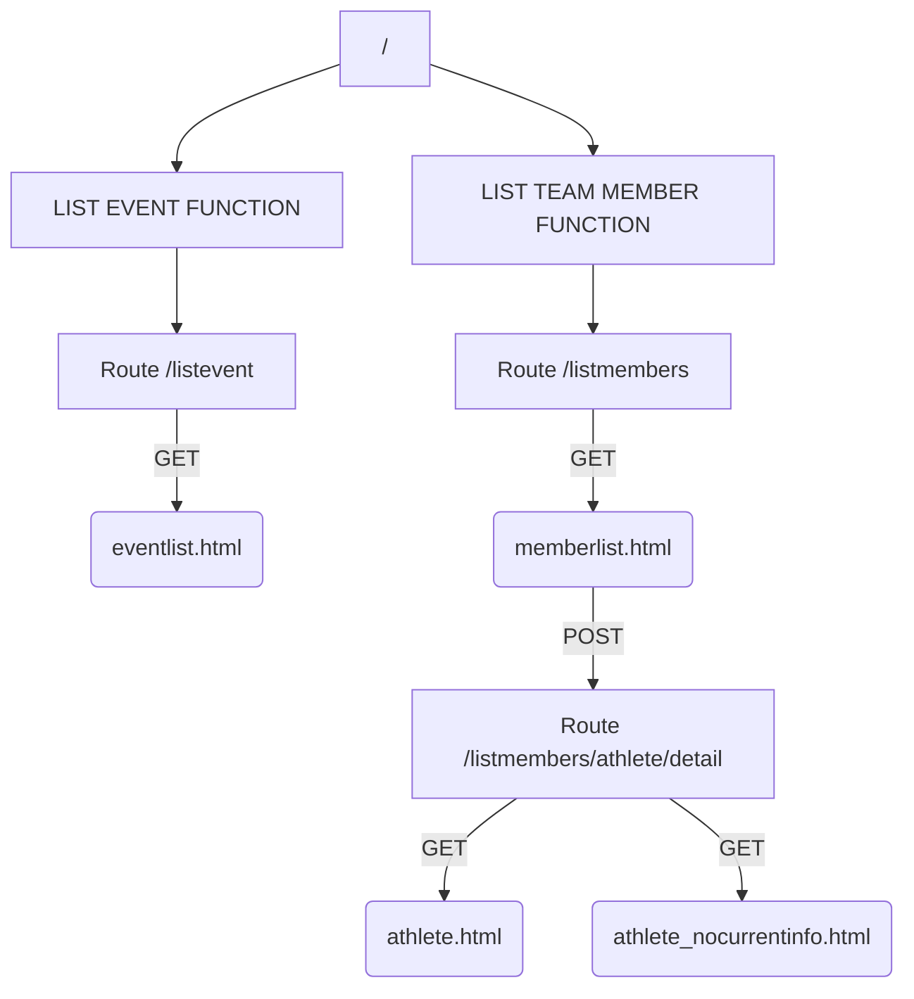

# 636_FinalProject

# NZ Winter Olympics Project Report
## Routes and Functions
As per requirement, this project has two interfaces. The public interface is accessible by the default route / and the admin interface is accessed by route /admin. The two interfaces are seperate and have no interaction for safety consideration. The two routes returns two seperate HTML templates, base.html and adminbase.html and there are different templates that extends from either interfaces seperately and respectively.

For public access, this interface has two major functions, the List Event function and the List Team Member function. The List Event function uses route /listevents, and gets data about the events from the "events" table in the database, passes it into the template eventlist.html and the templates display it as a table of list. The List Team Member function has the same mechanism in displaying a table of members: the route /listmembers gets data from the database and passes into the template memberlist.html, but in addition, the memberlist.html template is set to have another route /listmembers/athlete/detail, by clicking the member's name, in order to bring up a specific member's events or results details into another HTML page. A hidden form is used to pass the member ID into the route /listmembers/athlete/details, using POST methods, in order to pick up the right member. Depending on if the picked member has the required data in the database, this route returns to either the template athlete.html or athlete_nocurrentinfo.html. The graph below shows different routes and templates and how data flows.

## Assumptions
- The listmembers function from the public interface, the list showing has changed its order. Instead of showing memberID and TeamID, "Name" is created to combine FirstName and LastName from the db so the clickable link doesnt have a confusion. Also because of the link, the names have been moved to the first colunm.  
- Add/Edit function has a assumption that the memberid is readyonly and not chaangeable when editting. Also, a drop down has created to choose a team as I assume there is only new team added at the same time as adding a member. 

## Changes
### Database Changes
### App Changes

test
Change to show getting to PA

