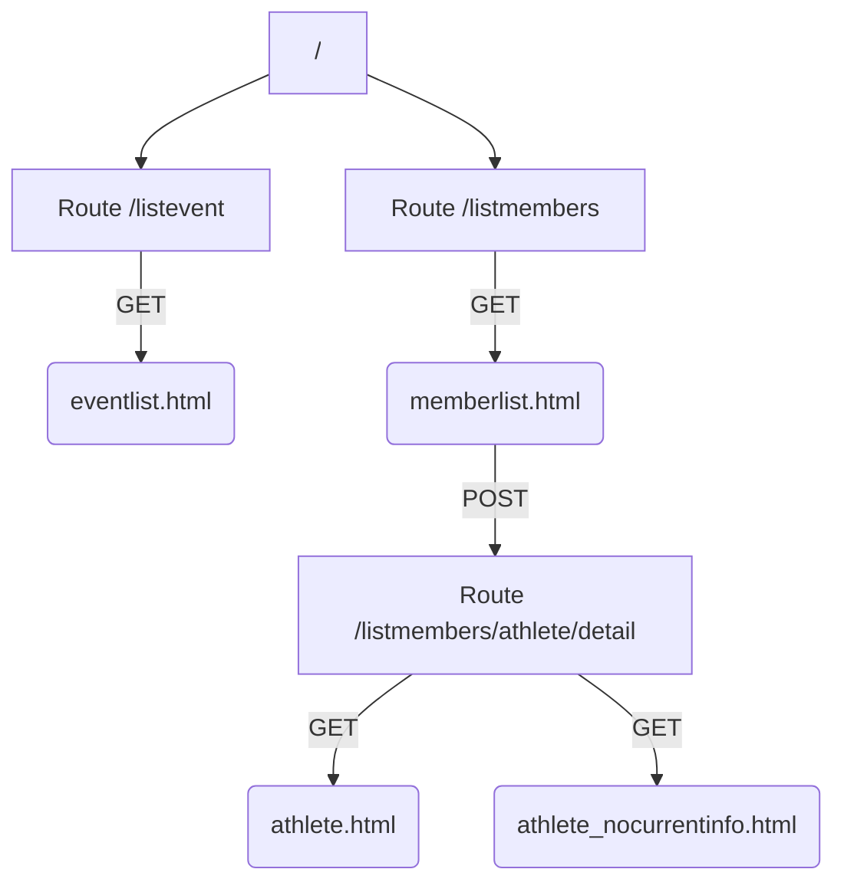
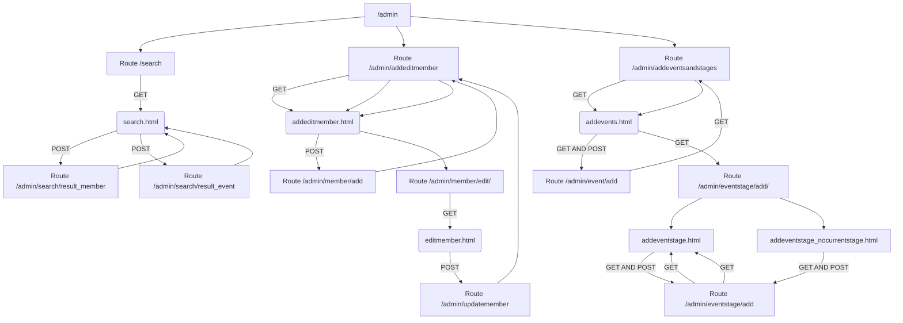
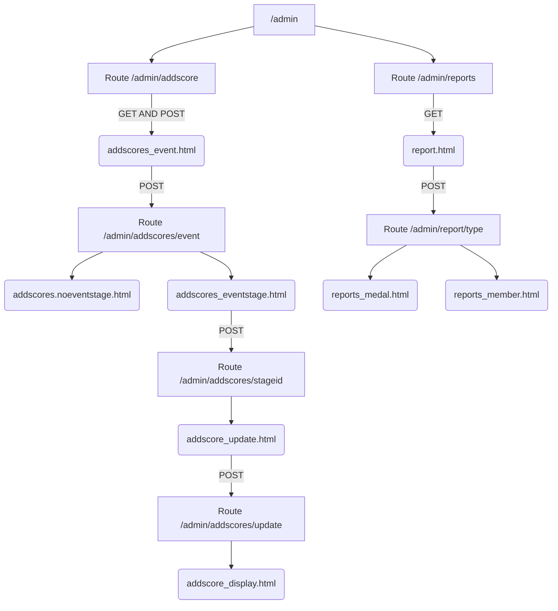

# NZ Winter Olympics Project Report
## Routes and Functions
As per requirement, this project has two interfaces. The public interface is accessible by the default route / and the admin interface is accessed by route /admin. The two interfaces are seperate and have no interaction for safety consideration. The two routes returns two seperate HTML templates, base.html and adminbase.html and there are different templates that extends from either interfaces seperately and respectively.

For the public access, this interface has two major functions, the List Event function and the List Team Member function. The List Event function uses route /listevents, and gets data about the events from the "events" table in the database, passes it into the template eventlist.html and the templates display it as a table of list. The List Team Member function has the same mechanism in displaying a table of members: the route /listmembers gets data from the database and passes into the template memberlist.html, but in addition, the memberlist.html template is set to have another route /listmembers/athlete/detail, by clicking the member's name, in order to bring up a specific member's events or results details into another HTML page. A hidden form is used to pass the member ID into the route /listmembers/athlete/details, using POST methods, in order to pick up the right member. Depending on if the picked member has the required data in the database, this route returns to either the template athlete.html or athlete_nocurrentinfo.html. The graph below shows different routes and templates and how data flows.

The admin interface has five main functions and each function has one or many templates which are extended from the adminbase.html. 

The Search funtion is accessed by route /search and returns to template search.html, which sets two routes, route /admin/search/result_member and route /admin/search/result_event. Both routes get data through the form in template search.html and pass it back to the same template. 

The Add/Edit Member function uses route /admin/addeditmember which returns to template addeditmember.html. This html then uses route /admin/member/add to get data from the user and passes it to database, then redirects to route /admin/addeditmember to show the member being added in the template addeditmember.html. To edit the member, the route /admin/member/edit/<memberid> gets the member ID and then gets the matching data from the databae then passes it into another template editmember.html. This new template page then gets data input from user and updates them in the database then redirect to route /admin/addeditmember to go back to template addeditmember.html.
   
The Add Events and Event Stages function has a base route /admin/addeventsandstages and it gets data from database back to template addevents.html. Similarly as the Add Member Function, addevents.html uses route /admin/event/add to get data from the user and passes it back to the database then redirects to route /admin/addeventsandstages. To add an stage event, the route /admin/eventstage/add/<eventid> gets the event ID from user then gets the matching data from the database then passes into either addeventstage_nocurrentstage.html or addeventstages.html, depending on if the chosen event has any current eventstage. The both templates work the same way, which get data from users, using the same route /admin/eventstage/add, and pass it back to database. This route also gets data from the updated database again then return to template addeventstage.html.
   

The Addscore or Position function uses route /admin/addscore, and gets data from the database to template addscores_event.html. This page then gets data from the user by route /admin/addscores/event to be used to get more data from the database, then passes them to either addscores_noeventstage.html or addscores_eventstage.html. The template addscores_eventstage.html then uses route /admin/addscores/stageid to get data from database then pass them into addsocres_update.html. The last page then gets data from user and put it back into the database using route /admin/addscores/update then returns to templates addscore_display.html.

The Report function has route /admin/reports and it returns to template report.html. This template then is set to have route /admin/report/type and it gets data from the user and passes it into the either reports_medal.html or reports_member.html. Route /admin/report/type also gets data from the database and passes them into either templates.     

## Assumptions
There are several assumption made to build this project. 
   
- The two interfaces are assumed to not interact with each other for the safety consideration, because there is no requirement for login and password for admin interface.
- The columns of tables in display do not need to have the same order as the order in the database. For example, in List Members function, the name has been put as the first column to be able to have url around it. 
- Add/Edit Member function has a assumption that member ID is allowed to be generated automatically, same applied to the Addsore funtion, when the result ID is not required from the users as it will be automatically generated. 
- This project assumes that the teams table will not be changed, so when adding a member or an event, a drop down are given to avoid validation issues. 
- For the method, GET or POST are used when the function is sending or retrieving information. If statements are used in app.py to determine which template to return to, and they are also used in html files to decide which form option to display. 
- The table display is designed to be simple and easy reading. 
   
## A discussion of changes for supporting multiple olympics
   There will be several changes made in order to support multiple olympics. 
### Database Changes
- For members and events, there should be a new column added, to reflect which olympics they belong to. 
- Teams will need to be allowed changing for adding new teams, as there would be different teams for different olympics. 
### App Changes
As the database will be changed, the routes that gets data from the database will need to be reviewed as the structure of the table might be different. The html pages which accept data from the routes will also need to be changed accordingly. Meanwhile, it might be a good idea to have different routes and interfaces for different olympics to simply the modification of other aspects in the app. 
