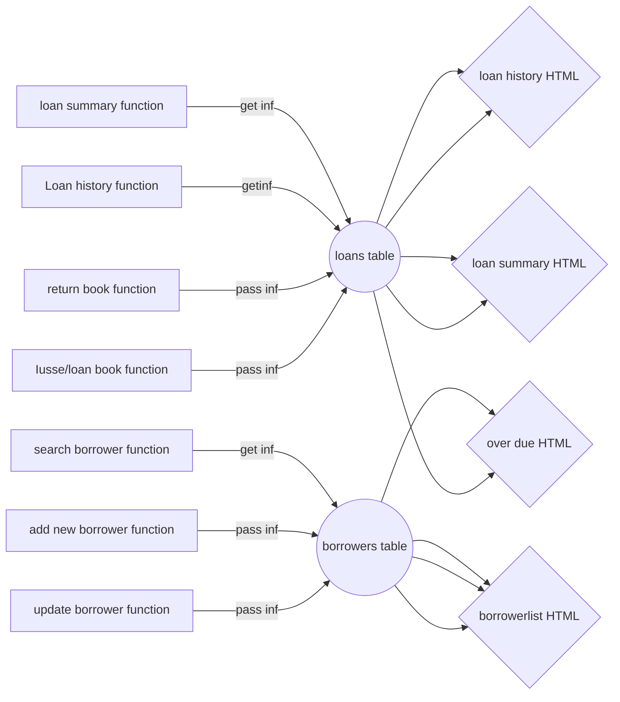

# 636_FinalProject

# NZ Winter Olympics Project Report
## Assumptions
- The listmembers function from the public interface, the list showing has changed its order. Instead of showing memberID and TeamID, "Name" is created to combine FirstName and LastName from the db so the clickable link doesnt have a confusion. Also because of the link, the names have been moved to the first colunm.  
- Add/Edit function has a assumption that the memberid is readyonly and not chaangeable when editting. Also, a drop down has created to choose a team as I assume there is only new team added at the same time as adding a member. 
## Routes and Functions
## Changes
### Database Changes
### App Changes

test
Change to show getting to PA

<![endif]-->

## Library management web app

**Structure of the solution**

According to the general requirements, the public interface must be displayed when the default route is accessed and the staff interface must be accessed by an alternative route which means there should be two separate functions for the public and staff and they do not interact. To achieve this, the templates were built separately for the public and staff even though they could share some same HTML pages. Under two separate interfaces, there are some different templates built to fulfil the requirements.  For public access, the search function is left on the home page where the user can search books by title or author. Besides that, there are four functions listed on the header fixed for the user to access, which are books list, book copies list, to loan a book and to check loan history. To make debugging easy, the booklist template and book copies list template was set up separately, which could be combined to tidy up the structure. The function loan book is to insert the table loans with the data borrower id, book copy id and date etc. then return to loan history HTML to see if it is successful. So, the function loan book and loan history return to the same HTML page.

Like the public interface, the staff route has some functions that share the same HTML page. The function search borrower, update borrower and add borrower return to the same HTML where the update and add borrower pass the new info to the borrower table. The updating borrower info is based on the borrower id while the add new borrower has auto-increment on generating borrower id. The function loan history, issue books and return books return to the same HTML page as the new info passes to the loans table which reflects on this HTML page. As the same as public route, the book copies share the same HTML page with the book search function. The rest functions have their own HTML page.

**Assumptions and Design Decisions**

There are several assumptions made to build this app. The first is that the public user doesn’t know the existence of the staff route, therefore these two routes are separated by using different templates. The second is that the user has a borrower id and loan id when borrowing and returning a book. As the size of the database is limited, when the user borrower the book, only the borrower id and book name with format is needed to simplify the process and app. For the method, most time the get and post method is used as the function is sending and retrieving information, such as function loan book, issue book, return book, add borrower, update borrower etc. The whole website is designed with a minimalism style to emphasise its library management functions with aesthetics.

**Discussion of supporting multiple library branches**

There are several changes should be made to support them if there are multiple library branches exist. Starting from the database, for books and book copies, there should be a new column added to specify which branch the book is currently in. For the loans table, there are two columns that need to be added which are the loan branch and the return branch. Updating the return branch should also update the current book location in the books and book copies table. These new columns are the key to managing the books, borrowing and returning process in different branches.

As for application, the books and book copies should show the current location of each book except the eBook and audiobook. There should be a few changes in the staff route, especially for returning books. The returning book should add the option of which branch the book returns to. But for loan and issue books, there is no need to choose the location as the location is bundled with the book copy id.

In conclusion, to manage multiple branches, adding the location of each physical book is a simple and useful way to achieve this.

